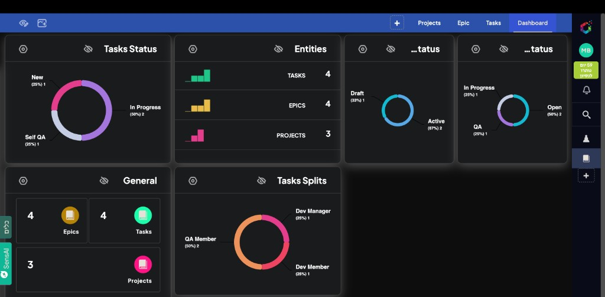

# Origami Smart PM

## What is this system?

Origami Smart PM is a structured project management system built on Origami.

It helps teams move from unclear work to structured delivery, controlled execution, and validated outcomes while preserving clear ownership, QA gates, and stakeholder visibility.

## Why it exists

The system gives teams one consistent operating model for:
- project definition
- work breakdown
- delivery control
- QA routing
- budget and progress visibility

## Core mindset

Context -> Goal -> Plan -> Execution -> QA -> Delivery

## Core structure

Project -> Epic -> Task

## Documentation Structure

All canonical project documentation lives under `docs/`.

### 1. Overview
- [Vision](docs/01-overview/vision.md)
- [Mindset](docs/01-overview/mindset.md)
- [Architecture](docs/01-overview/architecture.md)

### 2. Product
- [PRD](docs/02-product/PRD.md)
- [Entities](docs/02-product/entities.md)
- [Workflows](docs/02-product/workflows.md)

### 3. Implementation
- [Build Guide](docs/03-implementation/BUILD_GUIDE.md)
- [Origami setup](docs/03-implementation/origami-setup.md)
- [Permissions](docs/03-implementation/permissions.md)

### 4. Views
- [Dashboard](docs/04-views/dashboard.md)
- [Gantt](docs/04-views/gantt.md)
- [Boards](docs/04-views/boards.md)
- [Pages](docs/04-views/pages.md)

### 5. Operations
- [QA process](docs/05-operations/qa-process.md)
- [Delivery flow](docs/05-operations/delivery-flow.md)
- [Budget model](docs/05-operations/budget-model.md)

### 99. Exports
- [Full export](docs/99-exports/FULL_EXPORT.md)
- [PRD + Build merged](docs/99-exports/PRD_BUILD_MERGED.md)

## Who is this for?

- Project Managers
- Delivery Managers
- Developers
- QA Teams
- Stakeholders and clients
- AI tools such as ChatGPT and Cursor

## Where to start?

- Product understanding: `docs/02-product/PRD.md`
- Implementation: `docs/03-implementation/BUILD_GUIDE.md`
- Operations and delivery model: `docs/05-operations/`

## Diagrams and Images

All diagrams are stored under `assets/diagrams/`.

Primary diagrams:
- [System architecture](assets/diagrams/system-architecture.drawio)
- [QA flow](assets/diagrams/qa-flow.drawio)
- [Gantt logic](assets/diagrams/gantt-logic.drawio)
- [Pages structure](assets/diagrams/pages-structure.drawio)

Screenshots live under `assets/images/` and are embedded into the relevant docs.

## AI Usage

When using ChatGPT or Cursor:

1. Start with `README.md`.
2. Load `docs/02-product/PRD.md` for product truth.
3. Load `docs/03-implementation/BUILD_GUIDE.md` for Origami setup details.
4. Use the split docs for focused edits by topic.
5. Keep product changes aligned with current field names, workflow names, and QA logic.

## Product Screenshots

- [Dashboard example](docs/04-views/dashboard.md)
- [Timeline and planning examples](docs/04-views/gantt.md)
- [Board and table examples](docs/04-views/boards.md)
- [User and group setup example](docs/03-implementation/origami-setup.md)

