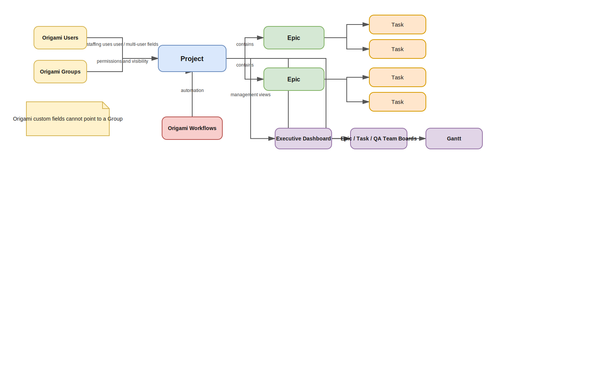
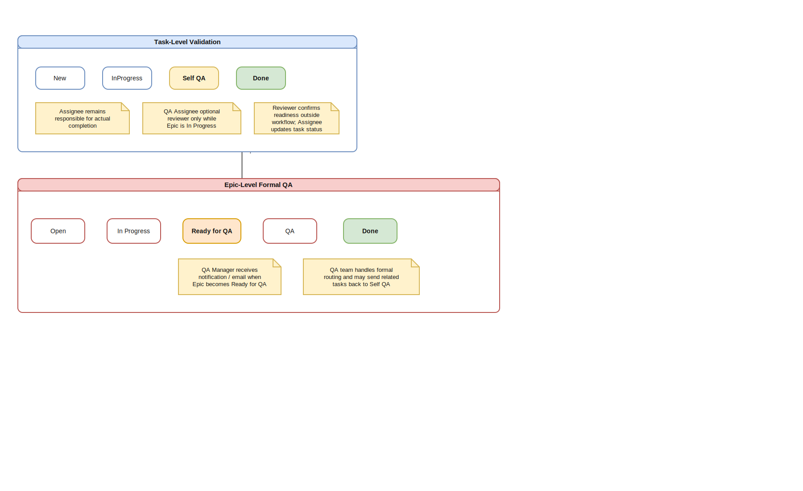
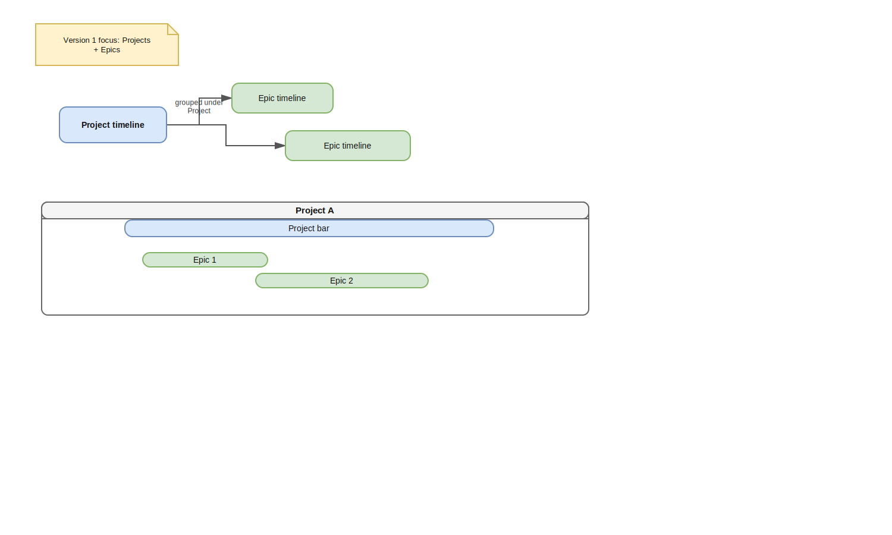
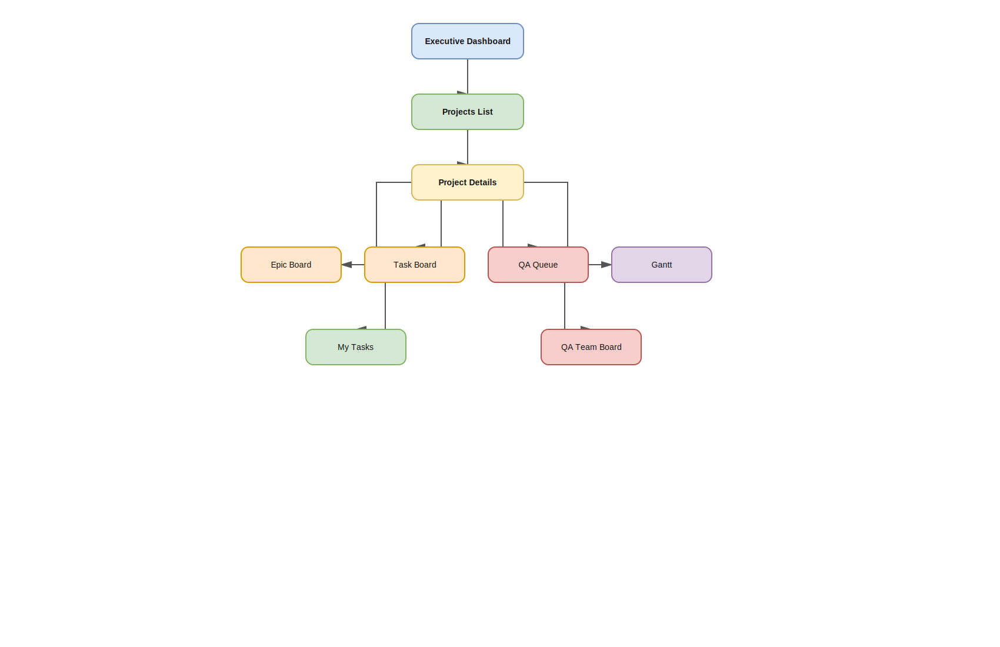

# JiraGami

Professional project management documentation for `Origami Smart PM`.

## Executive Summary

`JiraGami` is the documentation and management framework for `Origami Smart PM`, a production project management system built on Origami.

This repository is organized to help managers, delivery teams, implementers, and stakeholders understand:
- why the system exists
- what the product model contains
- how the platform is configured
- how delivery and Quality Assurance (QA) operate
- how the production setup should be governed and communicated

## Documentation Principles

- documentation changes must not change production truth
- product definitions remain separate from implementation guidance
- management governance documents support the product model and do not replace it
- each topic should have one clear canonical source
- document wording should read as professional Project Manager-owned documentation

## Core Delivery Model

Context -> Goal -> Plan -> Execution -> Quality Assurance (QA) -> Delivery

Core structure:

Project -> Epic -> Task

## Documentation Map

All canonical project documentation lives under `docs/`.

### 1. Overview
- [Vision](docs/01-overview/vision.md)
- [Mindset](docs/01-overview/mindset.md)
- [Architecture](docs/01-overview/architecture.md)

### 2. Product
- [Product Requirements Document (PRD)](docs/02-product/PRD.md)
- [Entities](docs/02-product/entities.md)
- [Workflows](docs/02-product/workflows.md)

### 3. Implementation
- [Build Guide](docs/03-implementation/BUILD_GUIDE.md)
- [Origami setup](docs/03-implementation/origami-setup.md)
- [Permissions](docs/03-implementation/permissions.md)

### 4. Views
- [Dashboard](docs/04-views/dashboard.md)
- [Gantt chart](docs/04-views/gantt.md)
- [Boards](docs/04-views/boards.md)
- [Pages](docs/04-views/pages.md)

### 5. Operations
- [Quality Assurance (QA) process](docs/05-operations/qa-process.md)
- [Delivery flow](docs/05-operations/delivery-flow.md)
- [Budget model](docs/05-operations/budget-model.md)

### 6. Governance
- [Governance README](docs/06-governance/README.md)
- [Project charter](docs/06-governance/project-charter.md)
- [Scope baseline](docs/06-governance/scope-baseline.md)
- [Roadmap](docs/06-governance/roadmap.md)
- [RAID log](docs/06-governance/raid-log.md)
- [RACI matrix](docs/06-governance/raci.md)
- [Communication plan](docs/06-governance/communication-plan.md)
- [Decision log](docs/06-governance/decision-log.md)
- [Success metrics](docs/06-governance/success-metrics.md)

### 99. Exports
- [Full export](docs/99-exports/FULL_EXPORT.md)
- [Product Requirements Document (PRD) + Build merged](docs/99-exports/PRD_BUILD_MERGED.md)

## Canonical Sources

Use these files as the primary truth for the production model:
- product definition: `docs/02-product/PRD.md`
- implementation design: `docs/03-implementation/BUILD_GUIDE.md`
- view baseline: `docs/04-views/pages.md`
- operating model: `docs/05-operations/`

The governance section supports management of the production project and should not alter the documented product behavior.

## Audience

- Project Managers
- Delivery Managers
- Product and implementation leads
- Developers
- Quality Assurance (QA) teams
- Stakeholders and clients
- Artificial Intelligence (AI) tools such as ChatGPT and Cursor

## Recommended Reading Paths

For product understanding:
1. `README.md`
2. `docs/01-overview/`
3. `docs/02-product/PRD.md`

For implementation planning:
1. `docs/02-product/PRD.md`
2. `docs/03-implementation/BUILD_GUIDE.md`
3. `docs/04-views/`

For management governance:
1. `docs/06-governance/project-charter.md`
2. `docs/06-governance/scope-baseline.md`
3. `docs/06-governance/roadmap.md`
4. `docs/06-governance/raid-log.md`
5. `docs/06-governance/raci.md`

## Project Management Terms

- `Product Requirements Document (PRD)` = the canonical product-definition document
- `Quality Assurance (QA)` = the validation and testing control layer
- `Project Manager (PM)` = the management role responsible for visibility and control
- `Gantt chart` = the management timeline view
- `Kanban board` = the board view used to track work by status
- `RAID` = risks, assumptions, issues, and dependencies
- `RACI` = responsible, accountable, consulted, and informed
- `Enterprise Resource Planning (ERP)` = deeper business-system finance logic that is out of scope for version 1
- `Artificial Intelligence (AI)` = tools such as ChatGPT and Cursor used to read and update the documentation

## Diagrams And Images

All diagrams are stored under `assets/diagrams/`.

Concept and structure:
- [System architecture](assets/diagrams/system-architecture.svg)
- [Pages structure](assets/diagrams/pages-structure.svg)

Workflow and delivery control:
- [Quality Assurance (QA) flow](assets/diagrams/qa-flow.svg)

Timeline and planning:
- [Gantt chart logic](assets/diagrams/gantt-logic.svg)

Setup and ownership:
- [Build order](assets/diagrams/build-order.svg)
- [Project ownership](assets/diagrams/project-ownership.svg)

Screenshots live under `assets/images/` and are embedded into the relevant docs.

### Inline Diagram Preview

#### System architecture

#### Quality Assurance (QA) flow

#### Gantt chart logic

#### Pages structure

## Artificial Intelligence (AI) Usage

When using ChatGPT or Cursor:

1. Start with `README.md`.
2. Load `docs/02-product/PRD.md` for Product Requirements Document (PRD) truth.
3. Load `docs/03-implementation/BUILD_GUIDE.md` for Origami setup details.
4. Use the split docs for focused edits by topic.
5. Keep product changes aligned with current field names, workflow names, and Quality Assurance (QA) logic.

## Product Screenshots

- [Dashboard example](docs/04-views/dashboard.md)
- [Timeline and planning examples](docs/04-views/gantt.md)
- [Board and table examples](docs/04-views/boards.md)
- [User and group setup example](docs/03-implementation/origami-setup.md)

