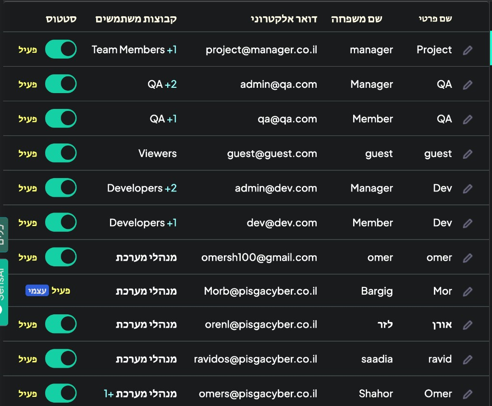

# Origami Setup

## Goal

This document separates Origami configuration concerns from product intent. Use it when configuring the workspace in Origami.

## Setup Sequence

1. Create groups and place users into them.
2. Extend native users with staffing and budget fields.
3. Create `Project`, then `Epic`, then `Task`.
4. Configure permissions.
5. Build the pages.
6. Add workflows and notifications.

## Core Group Set

- System Managers
- Project Managers
- Developers / Team Members
- QA Managers
- QA Members
- Viewers

## Entity Setup Notes

- Keep project-level staffing in `user` and `multi-user` fields only.
- Do not model project staffing with Group-based custom fields.
- Use built-in metadata where possible instead of custom audit fields.
- Keep budget and progress rollups workflow-driven.

## Build Order Context

The build order diagram should be read as a dependency sequence:
- core users, groups, and entities first
- permissions and core pages next
- workflows after the base views exist
- Gantt, QA Team Board, and notifications after the underlying model is stable

## Current Setup Reference

The current user and group configuration screenshot is useful as a reference for how roles and team membership are being represented in the workspace.

## Supporting Diagrams

- [Build order](../../assets/diagrams/build-order.svg)
- [Project ownership](../../assets/diagrams/project-ownership.svg)
