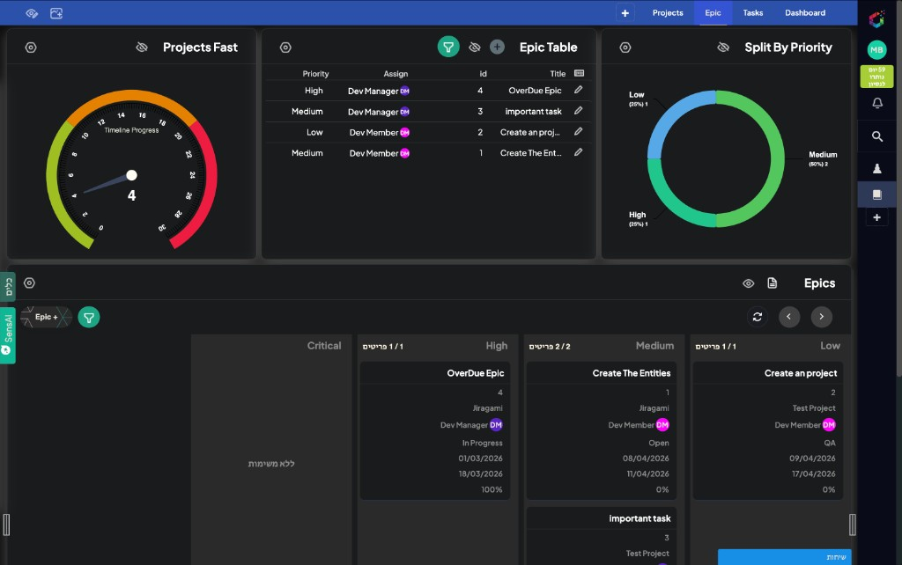
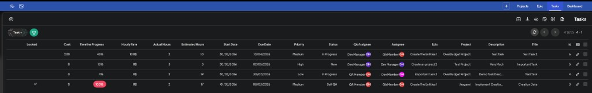

# Boards

## Project Views

### Projects List
- main projects table

### Project Details
- PM main page
- summary + goal + context + epics + tasks + staffing + budget

## Delivery Boards

### Epic Board
- Kanban by epic status: `Open | In Progress | Ready for QA | QA | Done`

### Task Board
- Kanban by task status: `New | InProgress | Self QA | Done`

### My Tasks
- filter by `Assignee = current user`

## QA Boards

### QA Queue
- task status = `Self QA`
- epic status = `Ready for QA` or `QA`

### QA Team Board
- epic-level Kanban: `Ready for QA | QA | Done`

## Current UI Examples

### Epic board view

This screenshot shows the current epic workspace with summary widgets, an epic table, a priority split chart, and the epic board itself.

### Task table view

This screenshot shows the current task table with delivery, QA, hours, dates, and status columns.

## Related Diagram

Page structure: [`../../assets/diagrams/pages-structure.svg`](../../assets/diagrams/pages-structure.svg)
