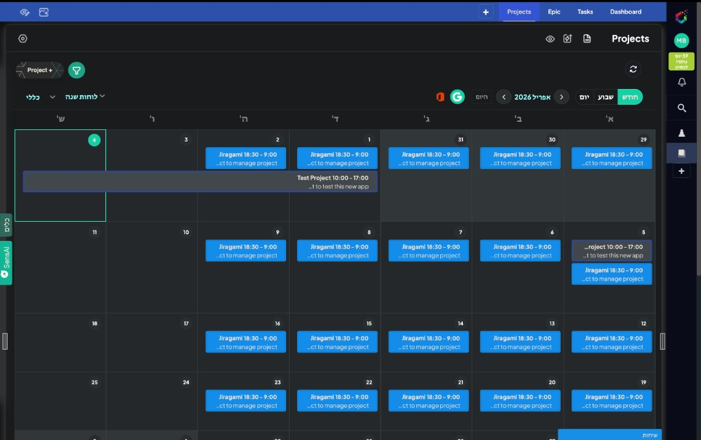
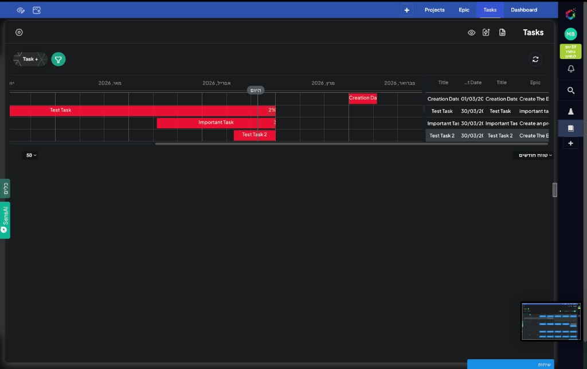

# Gantt

## Purpose

The Gantt page is a management timeline view for planning and control.

## Version 1 Focus

- Project timeline
- Epic timeline
- grouping under Project
- owner visibility
- start and end dates
- status color

Do not overload version 1 with task-level bars.

## Current UI Examples

### Project planning view

### Task timeline view

## Related Diagram

Gantt logic: [`../../assets/diagrams/gantt-logic.svg`](../../assets/diagrams/gantt-logic.svg)
